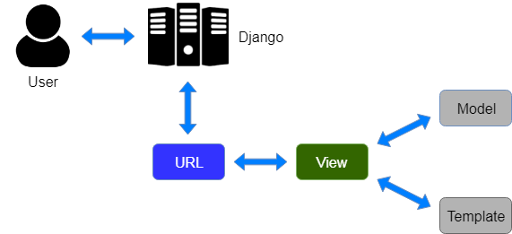

### Project Name : Django RBAC Employee Management System With API

- Repo : https://github.com/one-numan/django-RBAC-Employee-Management-System-With-API main Repo
- Repo Version apiV1 or 1.1.1 : https://github.com/one-numan/django-RBAC-Employee-Management-System-With-API/tree/main/EmployeeManagementSystem/apiV1

---

Table Of Content

1. [Name of project , Domain , Target Audience](#t1)

2. [Purpose of Project](#t2)

3. [Tools and Technologies](#t3)

   - [Front-End](#t3_1)

   - [Back-End](#t3_2)

   - [DB & Develoyment](#t3_3)

4. [Project Discription in Detail](#t4)

   - [Project Building Flow](#t4_1)

   - Architecture

     - [Django MVT Architecture](#t4_2_1)

     - [Django Rest FrameWork Architecture](#t4_2_2)

5. [Challenges & Solution](#t6)

6. [Advantages and Disadvantages](#t7)

---

### Name of project , Domain , Target Audience

<a name='t1'></a>
Name Of Project : EMS or Employee Management System

Target Audience : Student ( Build An Project For API)
Domain : HR , Hiring Manager , Employee Manger

### Purpose of Project

<a name='t2'></a>

- Learning Django and Django Rest Frameword
- Build Rest API and Perform CRUD Operation
- Build Multiple Table and Relation Between between using ORM ( Object Relation Mapping )
- Learning JSON Processing Serialization and DeSerialization
- Building Project Multiple Version
  - Version 1.0.1 Basic GUI App
  - Version 1.1.1 API version
  - Next Version Role Based Access Control / JWT Token in Api
- Role Based Access Control Pending

### Tools and Technologies

<a name='t3'></a>

- Front-End
  <a name='t3_1'></a>

  | Front-End Technologies | Version |
  | ---------------------- | ------- |
  | HTML                   | 5       |
  | CSS                    | 3       |
  | JS                     | ES6     |
  | Bootstrap              | 5.2     |

- Back-End
  <a name='t3_2'></a>

  | Backend-End Technologies | Version |
  | ------------------------ | ------- |
  | Python                   | 3.10.8  |
  | Django                   | 4.2.8   |
  | Django Rest Framework    | 3.44    |

- DB & Develoyment
  <a name='t3_3'></a>

  | Tools       | Name           |
  | ----------- | -------------- |
  | Database    | SQL Lite 3     |
  | Deployement | PythonAnyWhere |

### Project Discription in Detail

<a name='t4'></a>

#### Project Building Flow | Steps for Building Project

1. Installing Python and Create `Virtual env`

1. Django and Django Rest Framework

   ```
   pip install Django
   pip install Django Rest Framework
   ```

1. In Django Create Django Project

1. Create APP and According to Versions

1. Create Models Or Database

   - _Connect Muliple together Using Primary Key and Foreign Key_

1. Set-Up Serializer

   - _For Rest API's `GET Request`_

1. Set-Up De-Serializer

   - _For Rest API's `POST Request`_

1. Set Up Views or Controller

1. Set Up URLs or EndPoints

1. Finally All Steps are Done | Testing...

---

### Django Architecture

<a name='t4_2_1'></a>



Image Credits goes to [Geeks For Geeks](https://www.geeksforgeeks.org/django-rest-api-crud-with-drf/)

### Django Rest FrameWork Architecture

<a name='t4_2_2'></a>


Image Credits goes to [bezkoder](https://www.bezkoder.com/django-rest-api/)

---

### Challenges & Solution

<a name='t5'></a>

1. I was forget to added `rest_framework` in the `settings.py`

   - Please added `rest_framework` in the `settings.py`

   - After Install Django Rest Framework

   - Go the Project_dir/Project_dir
   - There is `settings.py` (One and Only Setting.py File in The Django Project)
   - Inside the File There and List

   ```python

      INSTALLED_APPS = [
         ...
         'rest_framework'
      ]
   ```

   - Please Write Correct Syntax Otherwise Its Raise Major Challenge

2. **ThumbRule** Before Write Code First Check Correct File
   - _In Django multiple files have same name ._
   - _When Your Write or Edit File_
     - **Please** Check your file name and Its Parent Directory\_
     - Then Write your code
     - If your forget the ThumbRule and do wrong . Its Hurts

### Advantages and Disadvantages

- Every New have advantage of Previous
- My Goal is to be solve every disadavantage and add advantages into new version
  - That version 1.1.1 have no RBAC and security but 1.2 will have RBAC feature and jwt for security purpose
